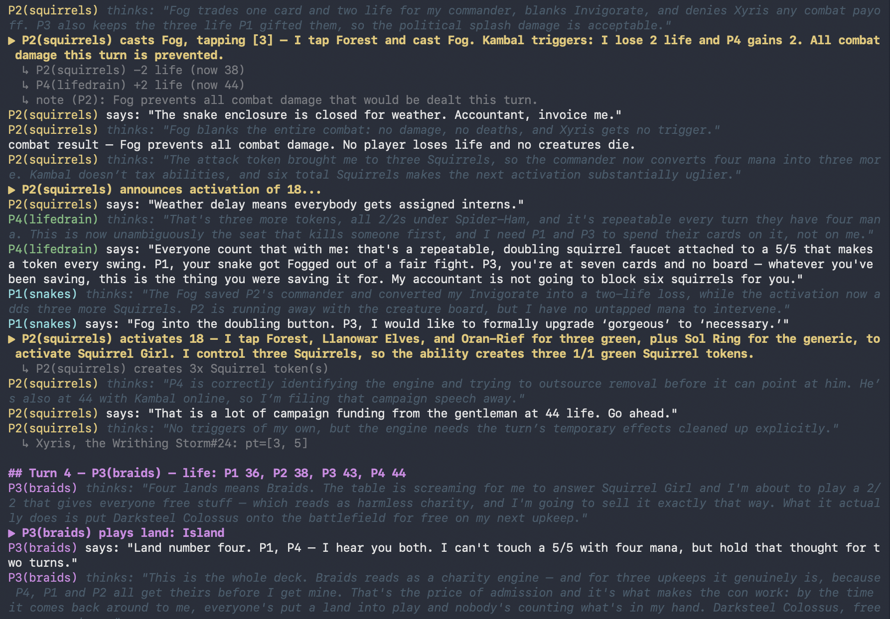

## llm kitchen-table commander.

minimal state-tracking sim that allows various claude or codex agents to play mtg against each other. due to the complexity of the mtg rules engine, the agents are left in charge of interpreting the cards, playing them correctly, and manipulating the game state to reflect their plays. the sim keeps track of life, shuffles, draws, battlefield presence, etc. allowing the llm players arbitrary control over their actions allows for the weirdness you get in actual games.



## how it works

the models already know the rules. they have quite extensive knowledge of cards, rulings, archetypes, etc. each seat is just a persistent `claude -p` or `codex exec` session. agents reply with json actions plus "effect atoms" incl move, life, create, draw, etc. the engine tracks exactly what the agents declare and handles anything involving hidden info: draws, tutors, shuffles, scry peeks, coin flips.

triggers, combat math, payments, ruling decisions, etc is on the agents. the agents will occasionally get something wrong, get called out, and take action to fix board state.

the stack is real: spells and abilities announce as stack objects, everyone gets response windows, responses can be responded to, and you get the last window on your own spells — so casting a pump and then responding to yourself with a second pump is just how holding priority works. counterspell wars go as deep as anyone wants (within a sane cap).

decisions that belong to someone else actually get asked: if you play smothering tithe, you register it once and the engine automatically asks each player "pay {2}?" on their draws until the tithe dies. same machinery covers rhystic study, punisher cards, votes — the agent declares what the card does, the engine just carries the question. 

for example: P3 mind controlled P1's creature. P1 then lost the game. the sim removed P1's board state but was unable to handle removing the P3-controlled creature and left it on the board. the table realized, and took an action to hand the creature back to nonexistent P1 (removing it from the game) explicitly, noting it as a correction of board state rather than a play.

theres also a judge channel: type into the terminal mid-game and it posts to the table as a ruling from `judge:`. they treat these as binding and will cite them turns later.

agents talk on two channels: `table_talk` is public for politics and trash talking, `thinking` is private commentary only you see. often you will see an agent privately reasoning about keeping four blue mana open as a bluff knowing it has nothing, but then openly representing a counterspell.

## running it

you need claude code and/or the codex cli, logged in, plus `uv`. then:

```bash
uv run play.py --pod claude:squirrels,codex:snakes,claude:meren,codex:aurelia
```

2-4 seats, each `agent:deck`, or `agent@model:deck` to pin a model per seat (`codex@gpt-5.6-sol:snakes`). the game streams to your terminal as shown above and saves to `games/` as markdown plus a jsonl event stream. claude seats default to opus5, codex to gpt-5.6-terra. theres also an `openrouter@provider/slug:deck` backend for seating oss models, and `local:deck` for whatever your lm studio / llama.cpp server is running.

## playing against them

you can take a seat yourself:

```bash
uv run play.py --pod claude:snakes,codex:meren,codex:aurelia,human:squirrels
```

you type plain words at a `you>` prompt, and a scribe agent (codex by default, `--human-agent claude` to switch) turns them into engine actions and does the bookkeeping:

```
you> how much mana for jaheira *and* crossroads
scribe: Four mana total: {2}{G} for Jaheira and {G} for Crossroads.
you> lets cast squirrel girl. next turn we want the combo pieces out
  → {"action":"cast","card":"The Unbeatable Squirrel Girl","tap":[...]}
```

a reminder fires when the game needs you, so you can alt-tab while the agents think. enter or `pass` passes a response window, `done` ends your turn, `"anything in quotes"` goes to the table as talk. you can ask the agent interpreting you questions about cards and board state and it will answer them to you privately without taking action unless you clearly request it. by default you can't see the other seats' private thinking (no wallhacks). `--show-hidden` if you'd rather spectate-while-playing and police yourself.

the agents don't know which seat is human. they will politick you, cut deals with you, and betray you on schedule.

## running a lot of games

```bash
uv run scripts/tourney.py --pod codex:meren,codex:snakes,codex:aurelia,codex:squirrels --n 8
uv run scripts/postmortem.py games/tourney_<stamp>/
```

tourney runs n games in parallel (pass `--pod` multiple times to vary the opposition per game). postmortem points a codex agent at each finished log: it reports the wincon that actually fired vs what the deck's memo promised, mvp and dead cards, who the table decided was the problem and when, and the one change most likely to flip the result — then a synthesis pass over all games writes a combined report with win rates, recurring failure modes, and proposed edits to your strategy memos. useful for playtesting a deck overnight without touching a keyboard.

## decks

we've included 21 stock decks (bracket ~2.5-3.5): unbeatable squirrel girl (ramp into infinite squirrel tokens and cause pain), squirrels_old (the same girl before the rebuild — slower mana, same crank), snakes (xyris group hug combat tricks — "here have cards" until they die), braids (everyone gets free stuff every upkeep but mine are eldrazi), lifedrain (anything anybody does drains them life and gives it to me), meren (graveyard grind), aurelia (boros fliers), hijack (loki turns every cheap combat trick into a theft — a voltron deck wearing a steal-denial mask), slivers (the first sliver makes every sliver spell cascade into another sliver, and they all buff each other), allgasnobrakes (gruul fat where the creatures are the ramp — the green one you just cast pays for the red one, and there is no interaction in the deck at all), aurafarming (mono-white auras: light-paws fetches a free aura onto herself every time you cast one, and turn four is usually lethal), octopus (mono-blue draw-go where every counterspell is also progress — lady octopus free-casts an artifact as big as her counter count, and the count ends at blightsteel colossus), mill (dimir horror mill — every creature milled off anyone's library becomes a 1/1, and the tokens feed the engines that mill again), dinos (temur control that wins with lizards — counter and remove early, ramp into enormous dinosaurs, then fight spells that kill their creature and pay you for damaging your own), isperia (azorius pillowfort — attacking anyone costs you cards, and it wins with approach of the second sun or a fat flier), talrand (draw-go where every instant leaves a 2/2 flier behind, so countering things is also building an army), karazikar (goad everything — the table fights everywhere except your face and every punch thrown pays you cards and treasure), marchesa (steal a creature, sacrifice it, keep it; +1/+1 counters bring your own bodies back, so wraths barely register), sigarda (auras on a hexproof flying angel nobody can target, until 21 commander damage lands), riversong (chaos — randomness and rule-changing effects, nothing behaves the way anyone planned), torbran (mono-red burn where every red source deals two extra, plus sweepers and anti-lifegain).

adding yours: paste any decklist export (moxfield/arena/deckstats formats all parse) into `data/decks/whatever.txt`. partners go in the same `Commander` section, both of them — each gets its own command zone and its own tax. then, to actually grab the rules text from each card:

```bash
uv run scripts/fetch_oracle.py data/decks/whatever.txt
```

optionally put a `// strategy: ...` comment at the top, the agents will read it and use it as guidance to play in case there are odd strategies they need to know about. what a guide needs to cover:

- what the deck is optimizing
- what the resource loops are
- which cards are interchangeable members of a package
- what sequencing errors matter
- what apparent "value" is actually bait
- how aggressive or conservative it should be
- mulligan heuristics
- how to recognize the transition from setup to killing people

combo decks are the exception to "packages, not card names" — when the play pattern is hunting specific pieces, list them as columns with their backups, because the redundancy is the information. a `// scouting: ...` line is the public counterpart — one or two sentences on what the deck does, shown to *every* seat, the way a pod knows each other's decks after a few games. the strategy memo stays private to its own seat. a `// personality: ...` line is private too — it is the seat's `table_talk` voice, so a squirrel deck sounds like a squirrel deck instead of four identical wry commentators. write it as three or four adjectives and then the character actually talking, in their own rhythm — the model copies the form of that sample closely, so capitalisation, punctuation and dialect in the sample are what you get back all game. give it something to perform: a stage direction like `*mutters*` comes back as rasps and coughs and long looks down the table. put a number on the length if the character is terse ("a word or two at most") — an adjective like "clipped" loses to the model's own habits. and keep the sample's sentences either about the character's outlook or too specific to reuse; a line that would fit any table ("cute little machine you've built") comes back verbatim, several times a game. a good scouting line says what the deck physically does — the pieces and the axis — rather than how scary it is. "puts protection auras on a fox" tells the table to interact before targeting stops working; "kills you on turn four" tells them nothing they can act on. it should be enough to play against and not enough to play for you, so your actual lines still land on turn six.

## known jank

- a wrong ruling stands if all four agents miss it. they self-correct a lot, but its not guaranteed. use the judge channel.
- extreme janky game-bending cards that can't be easily handled by the sim aren't able to be corrected for by the agents. if you absolutely need them, patch the sim.
  - no extra turns or weird turn order, the turn loop is a fixed rotation.
  - no shared zones (knowledge pool type stuff): cards live in exactly one player's zones.
- if agents are slow, their window will time out and the harness will pass its turn after 10 minutes.
- pumps, clones, attachments, first strike, commander damage, poison, floating mana, and "doesn't untap" are all manually tracked by agents, not in the sim. so there's potential for issues if the agents aren't on top of things.

in general - typical magic plays fine, but izzet solitaire or certain types of combo decks will be jank or unplayable. patch the sim if you're playing those.

we included "river song's chaos emporium" (`data/decks/riversong.txt`) as an example: this deck will probably not be playable in any sane manner, the sim does not have a way to handle many of its mechanics.
