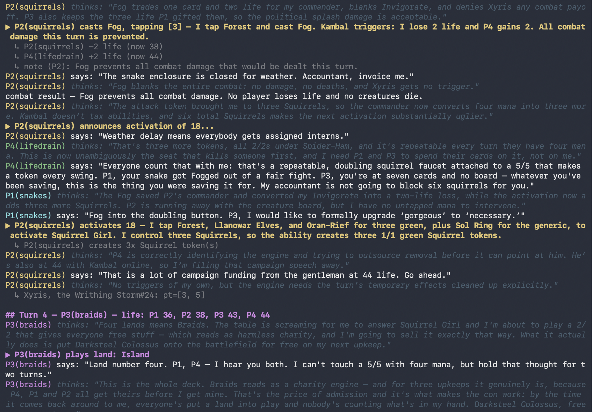

## llm kitchen-table commander.

minimal state-tracking sim that allows various claude or codex agents to play mtg against each other. due to the complexity of the mtg rules engine, the agents are left in charge of interpreting the cards, playing them correctly, and manipulating the game state to reflect their plays. the sim keeps track of life, shuffles, draws, battlefield presence, etc. allowing the llm players arbitrary control over their actions allows for the weirdness you get in actual games.



## how it works

the models already know the rules. they have quite extensive knowledge of cards, rulings, archetypes, etc. each seat is just a persistent `claude -p` or `codex exec` session. agents reply with json actions plus "effect atoms" incl move, life, create, draw, etc. the engine tracks exactly what the agents declare and handles anything involving hidden info: draws, tutors, shuffles, scry peeks, coin flips. there are also atoms for setting triggers like tithes: the sim fires a reminder on the specified phase every turn until an agent removes it. it also offers a response window to every player on every spell announcement so agents can use the stack to respond to effects before they resolve.

the engine tracks state and nothing else: zones, life, tapped and untapped, marked damage, counters on permanents and on players (+1/+1, poison, experience, etc arbitrarily named by agents), the stack, and the turn structure. everything a card *does* is declared by the seat playing it as effect atoms.

triggers, combat math, payments, ruling decisions, etc is on the agents. the agents will occasionally get something wrong, get called out, and take action to fix board state.

for example: P3 mind controlled P1's creature. P1 then lost the game. the sim removed P1's board state but was unable to handle removing the P3-controlled creature and left it on the board. the table realized, and took an action to hand the creature back to nonexistent P1 (removing it from the game) explicitly, noting it as a correction of board state rather than a play.

theres also a judge channel: type into the terminal mid-game and it posts to the table as a ruling from `judge:`. they treat these as binding and will cite them turns later.

agents talk on two channels: `table_talk` is public for politics and trash talking, `thinking` is private commentary only you see. often you will see an agent privately reasoning about keeping four blue mana open as a bluff knowing it has nothing, but then openly representing a counterspell.

## running it

you need claude code and/or the codex cli, logged in, plus `uv`. then:

```bash
uv run play.py --pod claude:squirrels,codex:snakes,claude:meren,codex:aurelia
```

2-4 seats, each `agent:deck`, or `agent@model:deck` to pin a model per seat (`codex@gpt-5.6-sol:snakes`). a bare `deck` is a codex seat; name `claude:` for a claude one. the game streams to your terminal as shown above and saves to `games/` as markdown plus a jsonl event stream. claude seats default to opus5, codex to gpt-5.6-terra. theres also an `openrouter@provider/slug:deck` backend for seating oss models, and `local:deck` for whatever your lm studio / llama.cpp server is running.

## playing against them

you can take a seat yourself:

```bash
uv run play.py --pod claude:snakes,codex:meren,codex:aurelia,human:squirrels
```

you type plain words at a `you>` prompt, and a scribe agent (codex by default, `--human-agent claude` to switch) turns them into engine actions and does the bookkeeping:

```
you> how much mana for jaheira *and* crossroads
scribe: Four mana total: {2}{G} for Jaheira and {G} for Crossroads.
you> lets cast squirrel girl. next turn we want the combo pieces out
  → {"action":"cast","card":"The Unbeatable Squirrel Girl","tap":[...]}
```

a reminder fires when the game needs you, so you can alt-tab while the agents think. enter or `pass` passes a response window, `done` ends your turn, `"anything in quotes"` goes to the table as talk. you can ask the agent interpreting you questions about cards and board state and it will answer them to you privately without taking action unless you clearly request it. by default you can't see the other seats' private thinking (no wallhacks). `--show-hidden` if you'd rather spectate-while-playing and police yourself.

the agents don't know which seat is human. they will politick you, cut deals with you, and betray you on schedule.

## web gui

```bash
uv run web/server.py --open
```

a browser front end for the same games: set up a pod, watch it play out live as an animated table, rewatch and analyze any saved game. it runs `play.py` underneath and reads the same `games/` files, so every game the cli has ever played is a replay here too.

- **games**: the pod you'll play next sits at the top as a banner of seats. click a seat's art to swap its deck, pick its agent and model right on it, hit start. below it, every saved game, searchable, with live ones first.
- **watching**: cards move between zones as the agents move them, the stack spotlights whatever's being cast with arrows to its targets, attackers lunge at who they're hitting, and life totals tick. auras and equipment sit tucked under whatever they're attached to, read from the casts, equips, and the agents' own notes. table talk shows up in a band across the middle of the table, private thinking too if you want it. the log on the right follows along and you can click any line to jump there. the timeline under the table draws everyone's life over the whole game; scrub it, or step by event or by turn. space plays and pauses.
- **live games**: you can stop them, speak to the table as the judge, or summon a codex ruling. a thinking mark shows who the table is waiting on.
- **playing**: pick `human` for a seat and you play from a console under the log: your prompt, one-click answers for the moment (keep, pass, end turn, resolve…), and the scribe's replies. click your own cards to drop their names into what you're typing. other seats' hands and thoughts stay hidden unless you flip on show hidden.
- **analyze**: life and board charts, per-seat stats, key moments that jump back into the replay, the codex postmortem, and an ask box where you can question an agent about the game ("how many land drops did meren miss", "why did aurelia's commander cost 8"). it reads the logs, counts, and cites turns you can click.
- **branch**: from any moment in a replay, restart the game from there with fresh or cloned minds.
- **decks**: every deck with its record, curve, colors, and your tag groups as a card grid. drop a moxfield / archidekt link into the new deck banner (tags come with the link) or paste a list from the clipboard button, then name it on its page. drop screenshots of your tags on a deck and claude reads them in.
- **settings**: default agents and models, codex effort and tier, turn caps, and viewer preferences.
- **sharing**: `uv run web/server.py --public 8766` adds a second port to point a tunnel at (`tailscale funnel --bg 8766`). anyone with the link can watch games, replays, and decks; anything that changes something asks for the password in `.cache/web/auth.json`, once per browser.

## running a lot of games

```bash
uv run scripts/tourney.py --pod codex:meren,codex:snakes,codex:aurelia,codex:squirrels --n 8
uv run scripts/postmortem.py games/tourney_<stamp>/
```

tourney runs n games in parallel (pass `--pod` multiple times to vary the opposition per game). postmortem points a codex agent at each finished log: it reports the wincon that actually fired vs what the deck's memo promised, mvp and dead cards, who the table decided was the problem and when, and the one change most likely to flip the result. then it runs a synthesis pass over all games and writes a combined report with win rates, recurring failure modes, and proposed edits to your strategy memos. useful for playtesting a deck overnight without touching a keyboard.

## decks

we've included a set of stock decks (bracket ~2-3.5) spanning combo, aggro, control, voltron, tokens, tribal, and politics, so a pod has something to play against out of the box.

adding yours: paste any decklist export (moxfield/arena/deckstats formats all parse) into `data/decks/whatever.txt`. partners go in the same `Commander` section, both of them — each gets its own command zone and its own tax. then, to actually grab the rules text from each card:

```bash
uv run scripts/fetch_oracle.py data/decks/whatever.txt
```

optionally put a `// strategy: ...` comment at the top, the agents will read it and use it as guidance to play in case there are odd strategies they need to know about. useful things to put in one: what the deck is optimizing, what the resource loops are, which cards are interchangeable members of a package, what sequencing errors matter, what apparent "value" is bait, how aggressive it should be, mulligan heuristics, and how to tell setup from the kill.

`// scouting: ...` is a public line every seat sees; `// personality: ...` is private and sets that seat's table-talk voice.


## known jank

- a wrong ruling stands if all four agents miss it. they self-correct a lot, but its not guaranteed. use the judge channel.
- extreme janky game-bending cards that can't be easily handled by the sim aren't able to be corrected for by the agents. if you absolutely need them, patch the sim.
  - no extra turns or weird turn order, the turn loop is a fixed rotation.
  - no shared zones (knowledge pool type stuff): cards live in exactly one player's zones.
- if agents are slow, their window will time out and the harness will pass its turn after 10 minutes.
- pumps, clones, attachments, first strike, commander damage, and floating mana are all manually tracked by agents, not in the sim. so there's potential for issues if the agents aren't on top of things.

in general, typical magic plays fine, but chaos solitaire or certain types of combo decks will be jank or unplayable. patch the sim if you're playing those.
